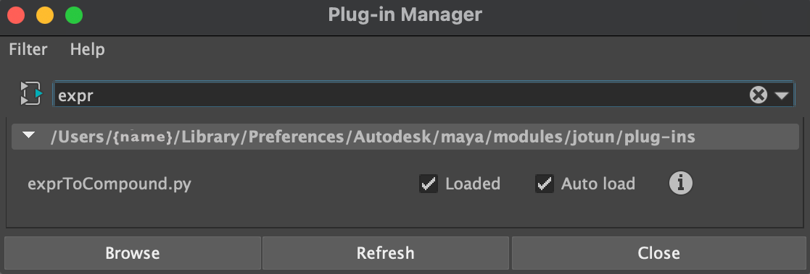

# Jotun Bifrost Utils

Jotun is a collection of utilities for working with Bifrost in Autodesk. These tools are designed to streamline the process of generating and manipulating Bifrost compounds for specific tasks. There is currently a single utility `exprToCompound` which takes a mathematical expression and converts it to a Bifrost compound. I have a number of additional utilities that I am working on that I plan on including here as soon as I can.

Utilities have been tested in Maya 2023 and above with Bifrost 2.7.1, but may work in previous version.

## Table of Contents

- [Installation](#installation)
- [Utilities](#utilities)
- [Future Development](#future-development)
- [License](#license)

## Installation

1. Download the latest [release](https://github.com/evanatherton/jotun_bifrost_utils/releases) and copy `jotun/` and `jotun.mod` to your Maya modules directory, depending on your operating system:
    ```
    macOS   ~/Library/Preferences/Autodesk/maya/modules
    Windows ~/Documents/maya/modules
    ```
   - If the `/modules` folder doesn't exist, create it
   - If you're on a Mac and don't see the path listed above, it's likely that your user Library folder is hidden (there are multiple Library folders on Macs). The correct Library folder is the user Library folder in Mac HD > Users > User Name, not the one that’s on the main HD. To make the user Library folder appear, follow these [instructions](http://osxdaily.com/2013/10/28/show-user-library-folder-os-x-mavericks/)


2. Launch Maya and load the available plugins in the `*/modules/jutun/plug-ins` section of Maya's Plug-in manager: `Windows > Settings/Preferences > Plug-in Manager`

    


3. Launch the desired utility by running the corresponding MEL command in the MEL command line at the bottom of the Maya UI. The MEL command for each utility matches the plugin name. i.e. to launch the `exprToCompound` utility, run `exprToCompound` in the MEL command line. You can also assign the MEL command to a shelf button for continued use.

    


## Utilities

### `exprToCompound`

Takes a mathematical expression and converts it into a Bifrost compound. Launch the tool with the `exprToCompound` MEL command and enter your expression using python syntax. The list of available operators can be found in [here](jotun/docs/expr_to_compound.md).


---
## Future Development

### Catenary Solver

The next utility planned for Jotun is a catenary curve solver for creating hanging ropes and cables.

## License

Jotun is licensed under the MIT license. See `LICENSE.md` for more information.
